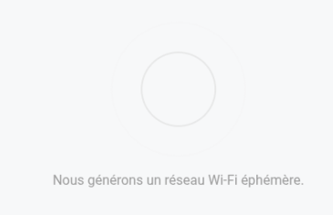
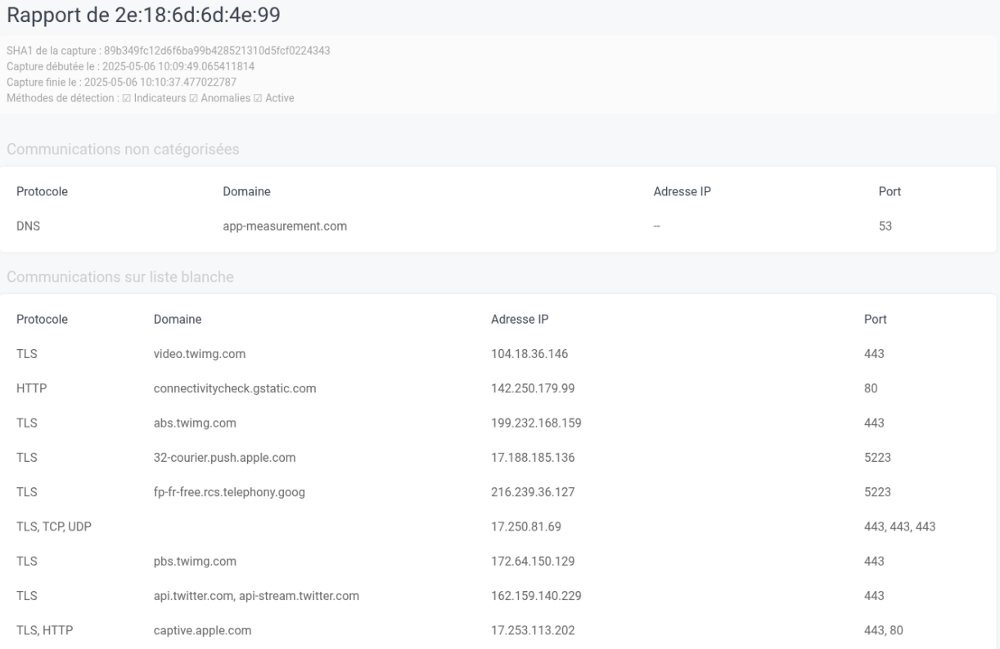
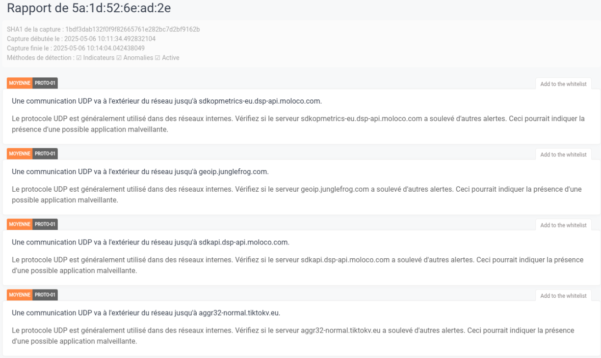

# Bienvenue sur la page d'aide et compréhension pour les utilisateurs de SpyGuard

Sur cette page, des explications seront données sur comment utiliser le logiciel SpyGuard ainsi que comment interprêter et comprendre le résultat affiché.

Veuillez cliquer sur ce <a href="https://localhost:8000" target="_blank">lien</a> pour utiliser le logicel SpyGuard afin de détecter la présence ou non d'un Spyware.

Si vous souhaitez modifier les paramètres ou les comprendre veuillez cliquer sur ce <a href="https://zeckkk7.github.io/aide_spyguard" target="_blank">lien</a>

## Page d'accueil

Voici la page d'accueil : 

Sur cette page vous avez le bouton **Allons-y** qui permet de lancer le logiciel. Vous avez également trois boutons en bas à droite. Le premier avec le logo de la maison permet de revenir sur cette page.
Le second, avec le logo des paramètres, permet d'accéder aux paramètres pour les modifier. Et le troisième permet d'éteindre l'ordinateur.

## Création du point d'accès

Une fois qu'on clique sur le bouton **Allons-y**, la création du point d'accès se met en place : 

Une fois le point d'accès créé, nous arrivons sur cette page : 

Sur cette page nous voyons, un QR code qui va vous permettre de vous connecter directement au Wi-fi créé par l'ordinateur en le scannant avec votre appareil (téléphoné, pc portable, tablette ...) ou alors vous pouvez utiliser les identifiants donnés.

## Capture

Une fois que vous êtes connecté au réseau Wi-fi avec votre appareil, il ne vous reste plus qu'à l'utiliser. 

Afin que l'analyse soit la plus proche de la réalité possible et le taux d'erreur le plus faible possible nous vous recommandons de faire cela :
- Faire l'analyse pendant environ 15mins
- Faire tout sur votre appareil que ce soit appeler, envoyer des messages, aller sur les réseaux sociaux, prendre des photos, etc ... Faites comme si vous l'utilisiez normalement
- Essayer de faire le test chez vous, car des logiciels pourraient être uniquement présents chez vous.

Une fois que vous estimez que l'analyse est fini et complète, cliquer sur le bouton **Arrêter la capture** sur la page web.

## Analyse

Une fois que vous avez arrêté la capture, le logiciel va rentrer en phase d'analyse : 

Pendant ce temps d'analyse ne faites rien de particulier, il suffit d'attendre. Cela peut être assez long alors patientez si l'analyse prend du temps.

## Résultat de l'analyse

Une fois que l'analyse est terminée, trois possibilités peuvent en découler. 

La première possibilité est : 

Si vous avez ce message en vert alors le logiciel n'a rien détecté sur votre appareil. Mais attention, ce n'est pas parce que le logiciel SpyGuard n'a rien détecté que votre appareil soit forcément exempt de logiciels espions.
Essayez de faire plusieurs analyses afin d'être sûr que le logiciel n'a pas fait un faux-négatif.

La deuxième possibilité est la suivante : 

Si vous avez ce message orange alors il faut faire attention. Cela ne veut pas forcément dire que votre appareil est infesté par un logiciel espion mais que le logiciel SpyGuard ne connaît pas tous les liens analysés. Par exemple, il pourrait vous dire ce message alors que vous êtes allé sur youtube. Il ne faut donc pas directement s'inquiéter mais plutôt se renseigner.

Et la dernière possibilité est : 

Si vous avez ce message en rouge alors votre appareil contient un logiciel espion. **Attention**, cela peut être un faux-positif il faut donc faire preuve de calme et ne pas paniquer.

## Le rapport

Maintenant que nous savons si l'appareil contient ou non un logiciel espion, on peut cliquer sur le bouton **Lire le rapport complet**. 

Voici un exemple de rapport (rapport pour un résultat vert) : 

On voit tout en haut à qui appartient le rapport, ici dans l'exemple 2e:18:6d…

Ensuite nous voyons le début et la fin de la capture, ainsi que les méthodes de détection. Mais cela n'est pas vraiment important.

Ce qui est vraiment important est la suite. 

En dessous nous voyons plusieurs listes d'éléments. 

La première liste qui s'appelle **Communications non catégorisées** correspond aux éléments qui ne sont pas dans la whitelist ou alors dans les IOCs. Cela ne veut pas dire que ce sont des logiciels espions ou qu'il faut s'en méfier mais juste que ces éléments ne sont pas dans la base de données du logiciel SpyGuard.

La deuxième liste **Communications sur liste blanche** correspond aux éléments qui ont été détectés lors de l'analyse mais qui sont dans les différentes listes blanches du logiciel SpyGuard.

Un deuxième exemple de rapport (résultat orange) est le suivant : 

Sur ce rapport nous voyons différents éléments qui sont considérés comme des éléments "dangereux" dans le sens où c'est une connexion initiée vers un lien que le logiciel SpyGuard ne connaît pas. Donc pour lui, c'est suspect. Voilà pourquoi ça apparait en orange.

Pour chaque élément il faut essayer de se renseigner, de regarder sur internet vers quoi ils pointent. Vous pouvez même demander à une IA si le lien est sûr ou pas.
Une fois que vous êtes assuré que l'élément n'est pas dangereux alors vous pouvez l'ajouter à la liste blanche en cliquant sur le bouton **Add to the whitelist**, afin que dans le futur si le même lien est détecté alors celui-ci ne sera pas détecter en tant que lien malvaillant