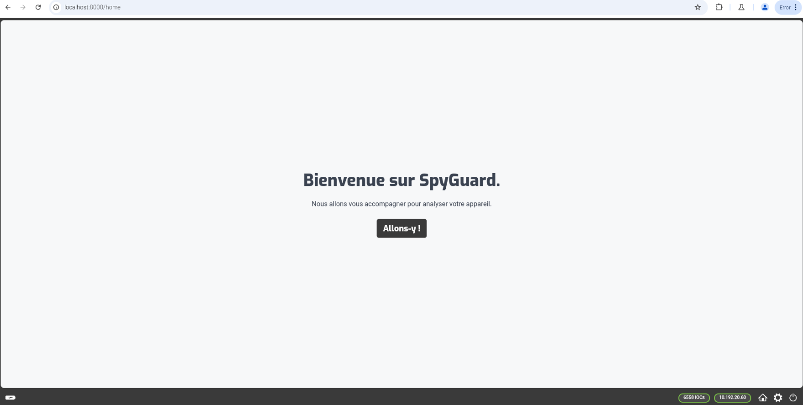
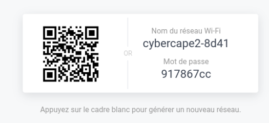
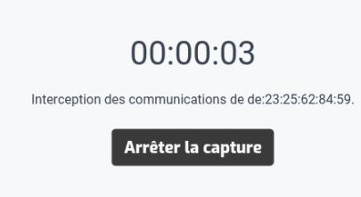
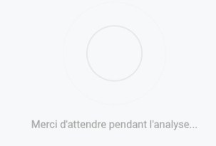
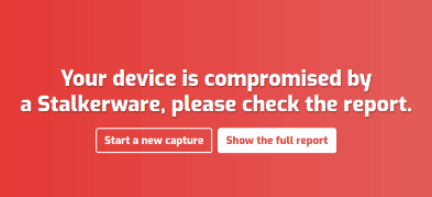

# Bienvenue sur la page d'aide et compréhension pour les utilisateurs de SpyGuard

Cette page explique comment utiliser SpyGuard et interpréter ses résultats.

- Utilisez ce <a href="https://spyguard.local:8000" target="_blank">lien</a> pour accéder au logiciel et vérifier la présence de logiciels espions.
- Consultez les <a href="https://zeckkk7.github.io/aide_spyguard" target="_blank">paramètres</a> pour des options avancées.

## Page d'accueil

Voici la page d'accueil : 

Sur la page d'accueil, cliquez sur **Allons-y !** pour démarrer SpyGuard.

## Création du point d'accès

Après avoir cliqué sur Allons-y, un point d'accès Wi-Fi sera créé. Connectez votre appareil via le QR code ou les identifiants affichés.

## Capture

Une fois que vous êtes connecté au réseau Wi-fi avec votre appareil, il ne vous reste plus qu'à l'utiliser. 

Afin que l'analyse soit la plus proche de la réalité possible et le taux d'erreur le plus faible possible nous vous recommandons de faire cela :
- Lancer l'analyse pendant 15min
- Utiliser votre appareil normalement (photo, sms, réseaux sociaux, etc ...)

Une fois les 15min passées, cliquer sur le bouton **Arrêter la capture**.

## Analyse

Une fois que vous avez arrêté la capture, le logiciel va rentrer en phase d'analyse : 

Pendant l'analyse, attendez patiemment, cela peut prendre du temps.

## Résultat de l'analyse

Une fois que l'analyse est terminée, trois possibilités peuvent en découler. 

La première possibilité est : 

Aucun logiciel espion détecté, mais cela n'exclut pas complètement leur présence. En effet ils peuvent être indétectable ou alors pas détectable par SpyGuard.

La deuxième possibilité est la suivante : 

Si vous avez ce message orange alors il faut faire attention. Cela ne veut pas forcément dire que votre appareil est infecté par un logiciel espion mais que le logiciel SpyGuard ne connaît pas tous les liens analysés.

Et la dernière possibilité est : 

Si vous avez ce message en rouge alors votre appareil contient un logiciel espion. **Attention**, cela peut être un faux-positif il faut donc faire preuve de calme et ne pas paniquer. Veuillez faire appel à la police afin de faire examiner votre appareil.

**Un rapport est généré (sauvegarder dans /home/pi/Downloads sur le rpi) suite à l'analyse pour les spécialistes.**
